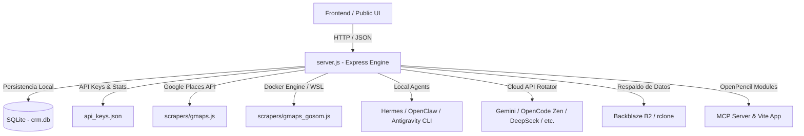

# Axis Panel — Command Center

**Axis Panel** (también conocido como **Axis Command Center**) es la consola de administración centralizada y el panel de control unificado para gestionar el ecosistema de **Hermes Cluster**, generación de leads comerciales (**Lead Gen**) y despliegue de **Cloud Shells**. Este sistema proporciona una interfaz intuitiva y potentes APIs para automatizar la recopilación de prospectos, interactuar de manera fluida con múltiples agentes de Inteligencia Artificial locales y en la nube, gestionar cuotas de APIs y asegurar copias de seguridad de datos críticos.

---

## 1. Arquitectura Técnica y Stack Tecnológico

El proyecto está diseñado bajo una arquitectura modular y robusta que combina servicios locales, automatización en segundo plano y proxies de comunicación compatibles con el estándar de OpenAI.



### Stack Tecnológico Principal:
*   **Servidor Backend**: [Node.js](https://nodejs.org/) + [Express](https://expressjs.com/) en [server.js](file:///C:/AxisPanel/server.js) como orquestador central de APIs y middlewares.
*   **Base de Datos**: [SQLite](https://sqlite.org/) gestionado con `better-sqlite3` en [server/crm-db.js](file:///C:/AxisPanel/server/crm-db.js) para garantizar alto rendimiento, transacciones y concurrencia optimizada mediante el modo *Write-Ahead Logging (WAL)*.
*   **Seguridad y Rate Limiting**: `express-rate-limit` para prevenir abuso de endpoints sensibles de API y autenticación.
*   **Integración de Autenticación**: Autenticación dual que soporta tokens estáticos compartidos y validación dinámica de tokens de identidad mediante el SDK de `firebase-admin`.
*   **Automatización de Respaldos**: Integración nativa con `rclone` (tanto a nivel de sistema host en Windows como en entornos de subsistema WSL).
*   **Scrapers de Leads**: Uso dual del SDK oficial de Google Maps (`@googlemaps/google-maps-services-js`) y la imagen dockerizada de Playwright `gosom/google-maps-scraper` a través de CLI y Docker de Windows/WSL.

---

## 2. Módulos y Funcionalidades Principales

El panel se compone de cinco módulos independientes, cada uno diseñado para cumplir un rol crítico en la automatización de operaciones comerciales y de desarrollo.

### 2.1. CRM & Leads Scraper
El sistema integra una potente base de datos relacional SQLite y dos motores de scraping para Google Maps con el fin de capturar, calificar y dar seguimiento a prospectos.

*   **Scraper de Google Maps (API Oficial)**: Implementado en [scrapers/gmaps.js](file:///C:/AxisPanel/scrapers/gmaps.js), se conecta a la API de Places y Place Details de Google Cloud para buscar negocios según palabras clave en Santiago de Chile y clasificar su score de prioridad (basado en la existencia de teléfono, sitio web, promedio de reseñas y horarios).
*   **Scraper de Google Maps (GOSOM/Dockerized)**: Implementado en [scrapers/gmaps_gosom.js](file:///C:/AxisPanel/scrapers/gmaps_gosom.js), ejecuta un scraper en una imagen de Docker (`gosom/google-maps-scraper`) para extraer datos de Google Maps sin límites de cuota, recopilando además correos electrónicos y perfiles de redes sociales de los leads de manera automatizada.
*   **Base de Datos CRM**: En [server/crm-db.js](file:///C:/AxisPanel/server/crm-db.js) se gestiona el esquema de tablas:
    *   `leads`: Información del prospecto, categoría, puntuación (*score*), metadatos geográficos y estado del flujo (`stage`).
    *   `pipeline_log`: Historial de transiciones entre etapas.
    *   `interactions`: Notas y registros de comunicaciones con los leads (emails, llamadas, etc.).
    *   `tasks`: Tareas y recordatorios de seguimiento asignados y con fecha límite.
    *   `enrichment_log`: Intentos e información recuperada durante el enriquecimiento del prospecto.
*   **Rutas de CRM**: Definidas en [server/crm-routes.js](file:///C:/AxisPanel/server/crm-routes.js), exponen endpoints para operaciones CRUD de leads, transiciones de etapa del Kanban (`new`, `contacted`, `responded`, `qualified`, `proposal`, `client`, `closed`, `lost`, `ignored`), adición de interacciones y estadísticas globales de conversión.
*   **Flujo Conversacional**: Como se define en [CONTEXT.md](file:///C:/AxisPanel/CONTEXT.md), el panel centraliza la interacción con el usuario en **AxisChat**. Cuando el usuario indica su intención de buscar clientes, se inicia un cuestionario dinámico secuencial (una pregunta a la vez) para recopilar los parámetros de búsqueda (búsqueda, ciudad y clasificación de categoría) e iniciar el scraping en segundo plano.

### 2.2. Multi-Agent Chat (`/api/chat/:agent`)
Axis Panel funciona como puerta de enlace inteligente (`gateway`) para dirigir mensajes hacia múltiples agentes de IA locales y remotos:

1.  **Hermes (Local)**: Envía peticiones al servidor local de inferencia Hermes (puerto `8642`) cargando dinámicamente el token de acceso desde `.hermes/.env` o cayendo en el token por defecto.
2.  **OpenClaw (Local)**: Envía consultas a la API de OpenClaw local (puerto `2024`) recuperando de manera segura el token desde `~/.openclaw/openclaw.json`. Si OpenClaw está fuera de línea, realiza un fallback automático hacia el proveedor de nube activo.
3.  **Antigravity (agy CLI)**: Permite interactuar con la CLI local de Antigravity (`agy.exe`). Para evitar riesgos de seguridad, el servidor ejecuta la herramienta mediante `child_process.spawn` enviando los comandos de manera estructurada con el flag `--print`.
4.  **Agentes Remotos en la Nube (Gemini, OpenCode, etc.)**: Enruta consultas directamente a proveedores como Google AI Studio, OpenCode Zen, OpenAI y Anthropic mediante el motor de rotación de claves del servidor.

### 2.3. Rotador de APIs & Monitoreo de Tokens
El backend implementa una arquitectura inteligente para mitigar fallos por límites de cuota (*rate limits*) o claves revocadas de APIs externas:

*   **Configuración y Estado**: Se apoya en los archivos [api_keys.json](file:///C:/AxisPanel/api_keys.json) (listado de claves, umbrales y proveedores activos) y `api_rotation_state.json` (puntero de la clave actual).
*   **Rotación Automática**: Ofrece endpoints `/api/rotate` para forzar la rotación a través de scripts de automatización (`auto_rotate.py` y [rotate.ps1](file:///C:/AxisPanel/rotate.ps1)).
*   **Monitoreo de Consumo Real**: Registra los tokens devueltos en las respuestas de las APIs (`usage.total_tokens`) y los acumula por fecha en la clave `tokens_used` dentro del archivo de configuración de API keys. Esto ayuda a visualizar el uso diario por proveedor y evitar la saturación de los modelos.

### 2.4. Integración de Almacenamiento (Backblaze B2 & Google Drive)
*   **Backblaze B2**: Permite agregar múltiples cuentas de almacenamiento B2. Incorpora un escaneo del peso total de directorios del usuario de Windows (Desktop, Documents, etc.) usando comandos PowerShell en segundo plano y comandos nativos en WSL. Automatiza la sincronización de archivos hacia los buckets mediante comandos de `rclone` dinámicos.
*   **Google Drive**: Proporciona endpoints de conexión simulada y listado de recursos sincronizados (archivos `.zip`, `.csv`, `.ipynb`, `.yaml`).

### 2.5. Módulo OpenPencil
Facilita la inicialización y el control del ecosistema de dibujo técnico y pizarras interactivas de OpenPencil:
*   **Servidor MCP (Model Context Protocol)**: Corre en el puerto `7600` (WS en `7601`) ejecutando código TypeScript (`packages/mcp/src/index.ts`) a través de un proceso hijo con `tsx`.
*   **Cliente OpenPencil**: Inicializa un servidor de desarrollo de Vite en el puerto `1420` para servir el lienzo web interativo.
*   El backend expone endpoints en `/api/mcp/openpencil` para verificar el estado de los servicios, recuperar herramientas disponibles y enviar mensajes conversacionales al canvas de forma asíncrona.

---

## 3. Configuración y Variables de Entorno

El comportamiento del servidor se puede configurar mediante las siguientes variables de entorno:

| Variable de Entorno | Descripción | Valor por Defecto |
| :--- | :--- | :--- |
| `AXIS_PORT` | Puerto en el que escuchará el servidor Express | `3030` |
| `AXIS_HOST` | Host para enlazar el servidor | `0.0.0.0` |
| `AXIS_AUTH_TOKEN` | Token estático compartido para asegurar la API de Axis Panel | `Pr0sp3r1d4d...c0m` |
| `AXIS_CONFIG_DIR` | Directorio de almacenamiento para las configuraciones y DBs | `~/.config` |
| `AXIS_HERMES_DIR` | Directorio raíz para configuraciones y logs de Hermes | `~/.hermes` |
| `FIREBASE_SERVICE_ACCOUNT` | Ruta al archivo JSON con credenciales de Firebase Admin | *Opcional* |
| `GOOGLE_APPLICATION_CREDENTIALS` | Ruta alternativa para la cuenta de servicio de Firebase Admin | *Opcional* |
| `GMAPS_API_KEY` | Clave API de Google Cloud para el scraper tradicional | *Leída dinámicamente* |
| `CF_ZONE_ID` | Zone ID de Cloudflare para crear subdominios | *Opcional* |
| `CF_API_TOKEN` | Token de API de Cloudflare con permisos de DNS | *Opcional* |
| `CF_DOMAIN` | Dominio raíz para los subdominios de nodos | `tudominio.com` |

Al iniciar por primera vez, el servidor copia automáticamente los archivos de plantilla `api_keys_initial.json` y `api_rotation_state_initial.json` al directorio de configuración final si no existen.

---

## 4. Guía de Instalación y Ejecución

### Prerrequisitos
*   **Node.js**: Versión 18 o superior instalada.
*   **Docker**: Requerido si planeas usar el scraper `GOSOM`.
*   **rclone**: Requerido para la integración de Backblaze B2.
*   **agy CLI**: CLI de Antigravity configurada en `%USERPROFILE%\AppData\Local\agy\bin\agy.exe`.

### Instalación de Dependencias

Ejecuta el siguiente comando en el directorio raíz para instalar todos los paquetes del sistema:

```bash
npm install
```

Las dependencias clave instaladas incluyen:
*   `better-sqlite3`: Controlador síncrono ultra rápido para SQLite.
*   `firebase-admin`: SDK administrativo de Firebase para autenticación federada.
*   `@googlemaps/google-maps-services-js`: Cliente Node.js para consumir servicios de Google Maps.
*   `express-rate-limit`: Middleware para limitar la tasa de solicitudes y mitigar ataques DoS.

### Scripts de Ejecución

*   **Iniciar Axis Panel**:
    ```bash
    npm start
    ```
    *(O utiliza el archivo por lotes [start_command_center.bat](file:///C:/AxisPanel/start_command_center.bat))*

*   **Iniciar OpenPencil (MCP + Vite)**:
    Usa el script de automatización [start_openpencil.bat](file:///C:/AxisPanel/start_openpencil.bat).

*   **Configurar Docker para GOSOM (Windows/WSL)**:
    Si encuentras errores de conexión con el demonio de Docker Desktop, ejecuta [setup_docker.bat](file:///C:/AxisPanel/setup_docker.bat) con permisos de Administrador para habilitar el socket TCP en el puerto `2375` o la integración de red con WSL.

---

## 5. Auditoría y Mejoras de Seguridad Recientes

Para garantizar la estabilidad del sistema operativo Windows y WSL ante posibles vulnerabilidades de inyección de código o fallos críticos, se han implementado las siguientes defensas:

1.  **Sanitización de Shell**: El servidor incorpora la función `sanitizeShellInput` que intercepta comandos de texto y elimina mediante expresiones regulares caracteres maliciosos de encadenamiento o redirección shell como `;`, `&`, `|`, `` ` ``, `$`, `!`, `#`, `~`, `<`, `>`, `*`, `?`.
2.  **Invocación Segura mediante Spawn**: Para lanzar la CLI `agy.exe` y los subprocesos de `OpenPencil` (MCP y Vite), se ha reemplazado la concatenación de comandos en cadenas libres por ejecuciones directas usando `child_process.spawn`. Esto aísla los argumentos del comando en arrays ordenados de ejecución nativa, imposibilitando la inyección de parámetros.
3.  **Habilitación de CORS y Proxies de Confianza**: Se configura el Express Engine para confiar en proxies inversos (`trust proxy = 1`) y restringir solicitudes externas cruzadas no autorizadas mediante políticas de CORS controladas.
